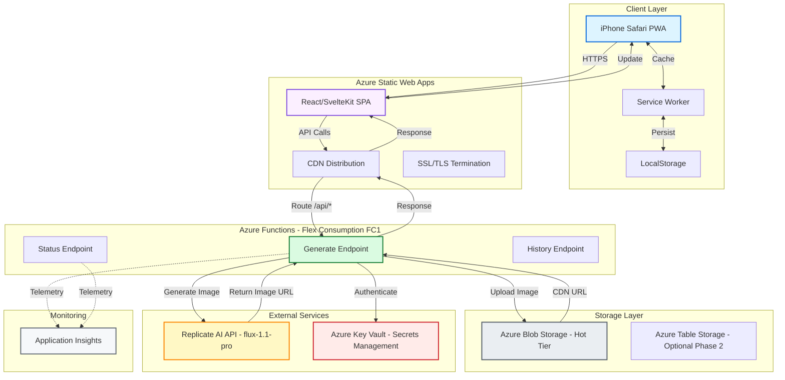
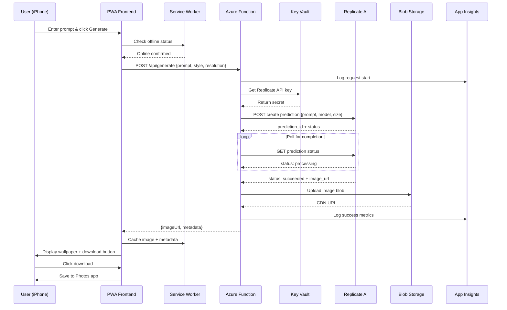
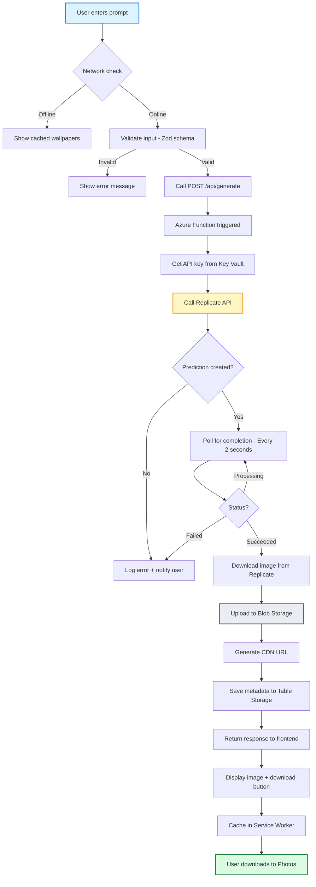
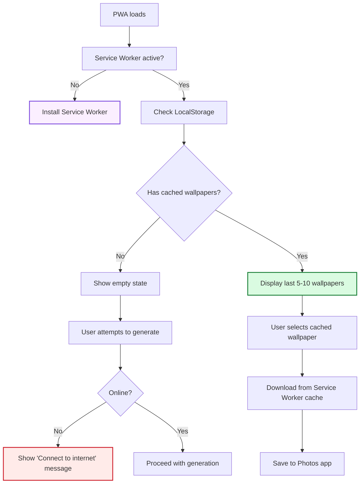
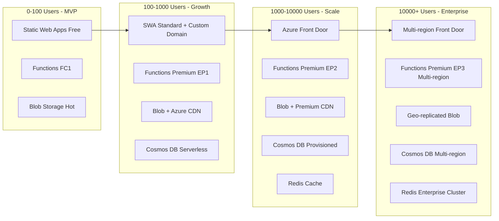

# AI Wallpaper Generator - Technical Architecture

**Project**: iPhone AI Wallpaper Generator
**Version**: 1.0.0 MVP
**Date**: February 20, 2026
**Platform**: Progressive Web App (PWA) + Azure Cloud

---

## Executive Summary

A mobile-first Progressive Web App for generating high-quality AI wallpapers optimized for iPhone devices. The system leverages Azure's serverless architecture and Replicate AI's image generation models to deliver a cost-effective, scalable solution for personal use with a clear path to commercialization.

**Key Metrics**:
- **Target MVP Cost**: ~$1.02/month (personal use, 200 wallpapers/month)
- **Expected Response Time**: 15-25 seconds per wallpaper
- **Target Device**: iPhone 16 Pro (iOS 26.4 beta)
- **Deployment Model**: Serverless (Azure Static Web Apps + Functions)

---

## Table of Contents

1. [System Architecture](#system-architecture)
2. [Infrastructure Components](#infrastructure-components)
3. [Technology Stack](#technology-stack)
4. [Data Flow](#data-flow)
5. [Security Architecture](#security-architecture)
6. [API Design](#api-design)
7. [Deployment Strategy](#deployment-strategy)
8. [Cost Analysis](#cost-analysis)
9. [Scalability & Performance](#scalability--performance)
10. [Monitoring & Observability](#monitoring--observability)
11. [Risk Mitigation](#risk-mitigation)

---

## System Architecture

### High-Level Architecture



### Component Interaction Flow



---

## Infrastructure Components

### 1. Azure Static Web Apps (Frontend Hosting)

**Purpose**: Host the Progressive Web App with built-in CI/CD and API routing.

**Configuration**:
```yaml
# staticwebapp.config.json (auto-generated by SWA CLI)
{
  "routes": [
    {
      "route": "/api/*",
      "allowedRoles": ["anonymous"]
    },
    {
      "route": "/*",
      "serve": "/index.html",
      "statusCode": 200
    }
  ],
  "navigationFallback": {
    "rewrite": "/index.html",
    "exclude": ["/api/*", "/*.{css,js,jpg,png,svg,ico,woff,woff2}"]
  },
  "globalHeaders": {
    "X-Content-Type-Options": "nosniff",
    "X-Frame-Options": "DENY",
    "Content-Security-Policy": "default-src 'self' https://*.azure.com https://replicate.com"
  }
}
```

**SKU**: Free Tier
**Bandwidth**: 100 GB/month (sufficient for MVP)
**Build Quota**: 500 build minutes/month

**Features**:
- ✅ Automatic SSL certificate
- ✅ Global CDN distribution
- ✅ GitHub Actions integration
- ✅ Custom domain support (Phase 2+)
- ✅ Staging environments

---

### 2. Azure Functions (Backend API)

**Purpose**: Serverless compute for AI image generation orchestration.

**Plan**: Flex Consumption (FC1) - Microsoft's recommended serverless tier for 2026

**Configuration**:
```json
// host.json
{
  "version": "2.0",
  "extensionBundle": {
    "id": "Microsoft.Azure.Functions.ExtensionBundle",
    "version": "[4.*, 5.0.0)"
  },
  "logging": {
    "applicationInsights": {
      "samplingSettings": {
        "isEnabled": true,
        "maxTelemetryItemsPerSecond": 5
      }
    }
  },
  "functionTimeout": "00:05:00"
}
```

**Runtime**:
- Node.js 20 LTS
- TypeScript
- Programming Model v4 (latest)

**Compute Specs**:
- Memory: 512 MB - 2 GB (auto-scale)
- Timeout: 5 minutes (default)
- Cold Start: ~800ms (Flex Consumption optimization)

**Functions**:

| Function | Method | Route | Timeout | Auth |
|----------|--------|-------|---------|------|
| `GenerateWallpaper` | POST | `/api/generate` | 5 min | Function key |
| `GetStatus` | GET | `/api/status/{id}` | 30 sec | Function key |
| `GetHistory` | GET | `/api/history` | 30 sec | Anonymous (Phase 1) |

---

### 3. Azure Blob Storage (Image Storage)

**Purpose**: Store generated wallpaper images with CDN-enabled access.

**Configuration**:
- **Storage Account Type**: StorageV2 (general purpose v2)
- **Performance Tier**: Standard
- **Access Tier**: Hot (for frequently accessed wallpapers)
- **Replication**: LRS (Locally Redundant Storage) - MVP cost optimization
- **Container**: `wallpapers` (public read access via SAS tokens)

**Lifecycle Management** (Phase 2):
```yaml
# Auto-delete wallpapers older than 30 days (personal use)
# Move to Cool tier after 7 days (commercial use)
```

**CDN Integration**:
- Azure CDN Standard (Microsoft)
- Automatic HTTPS
- Caching TTL: 7 days

**Estimated Storage**:
- Average wallpaper size: 2-4 MB (PNG, 1179x2556 for iPhone 16 Pro)
- 200 wallpapers/month × 4 MB = 800 MB
- **Monthly cost**: $0.018/GB = ~$0.014

---

### 4. Azure Key Vault (Secrets Management)

**Purpose**: Securely store API keys and connection strings.

**SKU**: Standard (no Premium HSM needed for MVP)

**Secrets Stored**:
```
secrets/
├── replicate-api-key          # Replicate AI authentication
├── storage-connection-string   # Blob storage access
└── app-insights-key           # Telemetry (auto-generated)
```

**Access Policy**:
- Azure Functions: GET secret permissions only
- Managed Identity enabled (no connection strings in code)

**Cost**: ~$0.03/10,000 operations (~$0.05/month for MVP)

---

### 5. Azure Table Storage (Optional - Phase 2)

**Purpose**: Track user generation history and metadata.

**Schema**:
```typescript
interface WallpaperRecord {
  partitionKey: string;      // userId or "anonymous"
  rowKey: string;            // generationId (GUID)
  prompt: string;            // User's text prompt
  style: string;             // "nature" | "abstract" | "minimalist"
  modelUsed: string;         // "flux-1.1-pro"
  blobUrl: string;           // CDN URL
  generatedAt: Date;
  costInCents: number;       // Track API cost
  resolution: string;        // "1179x2556" (iPhone 16 Pro native)
  downloadCount: number;
}
```

**Cost**: $0.05/GB storage + $0.01/100k transactions (~$0.10/month for MVP)

---

### 6. Azure Application Insights (Monitoring)

**Purpose**: End-to-end application monitoring and diagnostics.

**Metrics Tracked**:

**Performance**:
- Average generation time
- Function cold start duration
- Replicate API latency
- Blob upload duration

**Usage**:
- Wallpapers generated per day
- Most popular prompts/styles
- Error rates by type
- Unique users (IP-based for MVP)

**Alerting**:
- Error rate > 5%
- Average generation time > 40 seconds
- Replicate API failures

**Cost**: First 5 GB/month free, then $2.30/GB (~$2-3/month for MVP)

---

## Technology Stack

### Frontend (PWA)

**Framework Choice**: **SvelteKit** *(Recommended)* or React + Vite

#### Option 1: SvelteKit (Recommended for MVP)
```
Pros:
✅ Smaller bundle size (~25 KB vs 130 KB React)
✅ Better mobile performance
✅ Built-in SSR support (future-proof)
✅ Simpler state management

Cons:
❌ Smaller ecosystem
❌ Less familiar if new to Svelte
```

#### Option 2: React + Vite
```
Pros:
✅ Larger ecosystem and community
✅ More third-party components
✅ Easier to hire developers (commercialization)

Cons:
❌ Larger bundle size
❌ May need additional state management (Zustand/Redux)
```

**Dependencies** (SvelteKit):
```json
{
  "dependencies": {
    "@sveltejs/kit": "^2.5.0",
    "svelte": "^4.2.0"
  },
  "devDependencies": {
    "vite": "^5.0.0",
    "vite-plugin-pwa": "^0.19.0",
    "@vite-pwa/sveltekit": "^0.4.0",
    "typescript": "^5.3.0"
  }
}
```

**PWA Configuration**:
```javascript
// vite.config.ts
import { sveltekit } from '@sveltejs/kit/vite';
import { SvelteKitPWA } from '@vite-pwa/sveltekit';

export default {
  plugins: [
    sveltekit(),
    SvelteKitPWA({
      manifest: {
        name: 'AI Wallpaper Generator',
        short_name: 'Wallpapers',
        description: 'Generate beautiful AI wallpapers for your iPhone',
        theme_color: '#000000',
        icons: [
          {
            src: 'icon-192.png',
            sizes: '192x192',
            type: 'image/png'
          },
          {
            src: 'icon-512.png',
            sizes: '512x512',
            type: 'image/png',
            purpose: 'any maskable'
          }
        ],
        display: 'standalone',
        orientation: 'portrait'
      },
      workbox: {
        globPatterns: ['**/*.{js,css,html,svg,png,woff2}'],
        runtimeCaching: [
          {
            urlPattern: /^https:\/\/.*\.blob\.core\.windows\.net\/wallpapers\/.*/,
            handler: 'CacheFirst',
            options: {
              cacheName: 'wallpaper-images',
              expiration: {
                maxEntries: 10,
                maxAgeSeconds: 7 * 24 * 60 * 60 // 7 days
              }
            }
          }
        ]
      }
    })
  ]
};
```

---

### Backend (Azure Functions)

**Runtime**: Node.js 20 LTS
**Language**: TypeScript
**Programming Model**: v4 (latest, recommended by Microsoft)

**Key Libraries**:
```json
{
  "dependencies": {
    "@azure/functions": "^4.5.0",
    "@azure/identity": "^4.0.0",
    "@azure/keyvault-secrets": "^4.8.0",
    "@azure/storage-blob": "^12.17.0",
    "replicate": "^0.30.0",
    "zod": "^3.22.0"
  },
  "devDependencies": {
    "@azure/functions-core-tools": "^4.0.5455",
    "typescript": "^5.3.0"
  }
}
```

**Project Structure** (Azure best practice):
```
wallpaper-api/
├── host.json                  # Function host config
├── local.settings.json        # Local development secrets
├── package.json
├── tsconfig.json
├── src/
│   ├── functions/
│   │   ├── generateWallpaper.ts    # Main generation endpoint
│   │   ├── getStatus.ts            # Check generation status
│   │   └── getHistory.ts           # User history
│   ├── services/
│   │   ├── replicateService.ts     # Replicate API client
│   │   ├── storageService.ts       # Blob upload logic
│   │   └── keyVaultService.ts      # Secret retrieval
│   ├── models/
│   │   └── schemas.ts              # Zod validation schemas
│   └── utils/
│       ├── logger.ts               # Structured logging
│       └── errors.ts               # Custom error types
└── tests/
    └── integration/
```

---

### AI Image Generation

**Provider**: Replicate
**Primary Model**: `black-forest-labs/flux-1.1-pro`
**Backup Model**: `stability-ai/sdxl` (if flux unavailable)

**Model Specifications**:

| Spec | flux-1.1-pro | sdxl |
|------|--------------|------|
| Max Resolution | 4096x4096 | 2048x2048 |
| Aspect Ratio Support | Custom | Fixed ratios |
| Average Generation Time | 15-25 sec | 10-15 sec |
| Cost (GPU time) | $0.000225/sec | $0.000050/sec |
| Quality | Photorealistic | Artistic |
| **Best For** | Final wallpapers | Quick previews |

**Generation Parameters**:
```typescript
const generationConfig = {
  model: "black-forest-labs/flux-1.1-pro",
  input: {
    prompt: userPrompt,
    width: 1179,           // iPhone 16 Pro native resolution
    height: 2556,          // 19.5:9 aspect ratio
    num_outputs: 1,
    guidance_scale: 7.5,
    num_inference_steps: 50,
    output_format: "png",
    output_quality: 95
  }
};
```

---

## Data Flow

### 1. Wallpaper Generation Flow



### 2. Offline Mode Flow



---

## Security Architecture

### 1. Authentication & Authorization

**Phase 1 (MVP - Personal Use)**:
- **Frontend**: No authentication (single user)
- **API**: Function-level keys (managed by Azure)
- **Storage**: Public read via time-limited SAS tokens

**Phase 2 (Enhanced)**:
- **Frontend**: Simple PIN or device fingerprint
- **API**: Azure Functions authentication middleware
- **Storage**: User-scoped containers

**Phase 3 (Commercial)**:
- **Frontend**: Apple Sign-In (OAuth 2.0)
- **API**: JWT validation with Azure AD B2C
- **Storage**: Private containers with user-specific access

### 2. API Security

**Function Key Management**:
```typescript
// Azure Functions automatically handles function keys
// Keys stored in: https://<function-app>.scm.azurewebsites.net/api/functions/admin/masterkey

// Request format:
// POST https://<function-app>.azurewebsites.net/api/generate?code=<function-key>
```

**CORS Configuration**:
```json
// host.json
{
  "version": "2.0",
  "extensions": {
    "http": {
      "cors": {
        "allowedOrigins": [
          "https://<static-web-app>.azurestaticapps.net"
        ],
        "supportCredentials": false
      }
    }
  }
}
```

### 3. Secrets Management

**Key Vault Integration** (Managed Identity):
```typescript
import { SecretClient } from "@azure/keyvault-secrets";
import { DefaultAzureCredential } from "@azure/identity";

const credential = new DefaultAzureCredential();
const client = new SecretClient(
  "https://<keyvault-name>.vault.azure.net",
  credential
);

async function getReplicateApiKey(): Promise<string> {
  const secret = await client.getSecret("replicate-api-key");
  return secret.value;
}
```

**Environment Variables** (never in code):
```bash
# local.settings.json (excluded from git)
{
  "IsEncrypted": false,
  "Values": {
    "AzureWebJobsStorage": "UseDevelopmentStorage=true",
    "FUNCTIONS_WORKER_RUNTIME": "node",
    "KEY_VAULT_URL": "https://<name>.vault.azure.net",
    "STORAGE_ACCOUNT_NAME": "wallpaperstorage"
  }
}
```

### 4. Content Safety (Phase 3)

**Azure Content Safety API** for NSFW filtering:
```typescript
import { ContentSafetyClient } from "@azure/ai-content-safety";

async function validateImage(imageUrl: string): Promise<boolean> {
  const client = new ContentSafetyClient(endpoint, credential);
  const result = await client.analyzeImage({ image: imageUrl });

  return !result.categoriesAnalysis.some(
    cat => cat.severity >= 4 // Reject high-severity content
  );
}
```

---

## API Design

### REST API Specification

**Base URL**: `https://<app-name>.azurestaticapps.net/api`

---

#### POST /api/generate

**Description**: Generate a new AI wallpaper

**Request**:
```typescript
interface GenerateWallpaperRequest {
  prompt: string;              // Max 500 chars
  style?: "nature" | "abstract" | "minimalist" | "cyberpunk";
  resolution?: "1179x2556" | "1290x2796" | "1320x2868";
  model?: "flux" | "sdxl";
}
```

**Request Example**:
```json
{
  "prompt": "Serene mountain landscape at golden hour, vibrant colors, ultra detailed",
  "style": "nature",
  "resolution": "1179x2556",
  "model": "flux"
}
```

**Response**:
```typescript
interface GenerateWallpaperResponse {
  id: string;                  // Generation ID
  status: "processing" | "succeeded" | "failed";
  imageUrl?: string;           // CDN URL (when succeeded)
  thumbnailUrl?: string;       // 400x867 preview
  metadata: {
    prompt: string;
    resolution: string;
    model: string;
    generatedAt: string;       // ISO 8601
    processingTimeMs: number;
  };
  error?: {
    code: string;
    message: string;
  };
}
```

**Status Codes**:
- `202 Accepted`: Generation started
- `400 Bad Request`: Invalid input
- `429 Too Many Requests`: Rate limit exceeded
- `500 Internal Server Error`: Server error

---

#### GET /api/status/{id}

**Description**: Check generation status

**Response**:
```typescript
interface StatusResponse {
  id: string;
  status: "pending" | "processing" | "succeeded" | "failed";
  progress?: number;           // 0-100 (if available from Replicate)
  imageUrl?: string;
  estimatedTimeRemainingSeconds?: number;
}
```

---

#### GET /api/history

**Description**: Get user's recent wallpapers (Phase 2+)

**Query Parameters**:
- `limit` (default: 10, max: 50)
- `offset` (default: 0)

**Response**:
```typescript
interface HistoryResponse {
  wallpapers: Array<{
    id: string;
    imageUrl: string;
    thumbnailUrl: string;
    prompt: string;
    generatedAt: string;
  }>;
  total: number;
  hasMore: boolean;
}
```

---

## Deployment Strategy

### CI/CD Pipeline (GitHub Actions)

**Workflow File**: `.github/workflows/deploy.yml`

```yaml
name: Deploy to Azure

on:
  push:
    branches: [main]
  pull_request:
    branches: [main]

jobs:
  build-and-deploy:
    runs-on: ubuntu-latest
    steps:
      - uses: actions/checkout@v4

      # Frontend build
      - name: Setup Node.js
        uses: actions/setup-node@v4
        with:
          node-version: '20'

      - name: Install frontend dependencies
        working-directory: ./wallpaper-app
        run: npm ci

      - name: Build frontend
        working-directory: ./wallpaper-app
        run: npm run build

      # Backend build
      - name: Install backend dependencies
        working-directory: ./wallpaper-api
        run: npm ci

      - name: Build backend
        working-directory: ./wallpaper-api
        run: npm run build

      # Deploy to Azure Static Web Apps
      - name: Deploy to Azure Static Web Apps
        uses: Azure/static-web-apps-deploy@v1
        with:
          azure_static_web_apps_api_token: ${{ secrets.AZURE_STATIC_WEB_APPS_API_TOKEN }}
          repo_token: ${{ secrets.GITHUB_TOKEN }}
          action: "upload"
          app_location: "/wallpaper-app"
          api_location: "/wallpaper-api"
          output_location: "build"
```

### Infrastructure as Code (Bicep)

**File**: `infra/main.bicep`

```bicep
@description('The Azure region for all resources')
param location string = resourceGroup().location

@description('The name of the application')
param appName string = 'wallpaper-ai'

// Storage Account
resource storageAccount 'Microsoft.Storage/storageAccounts@2023-01-01' = {
  name: '${appName}storage'
  location: location
  sku: {
    name: 'Standard_LRS'
  }
  kind: 'StorageV2'
  properties: {
    accessTier: 'Hot'
    supportsHttpsTrafficOnly: true
    minimumTlsVersion: 'TLS1_2'
  }
}

// Blob Container
resource blobContainer 'Microsoft.Storage/storageAccounts/blobServices/containers@2023-01-01' = {
  name: '${storageAccount.name}/default/wallpapers'
  properties: {
    publicAccess: 'None'
  }
}

// Key Vault
resource keyVault 'Microsoft.KeyVault/vaults@2023-07-01' = {
  name: '${appName}-kv'
  location: location
  properties: {
    sku: {
      family: 'A'
      name: 'standard'
    }
    tenantId: subscription().tenantId
    enableRbacAuthorization: true
  }
}

// Application Insights
resource appInsights 'Microsoft.Insights/components@2020-02-02' = {
  name: '${appName}-insights'
  location: location
  kind: 'web'
  properties: {
    Application_Type: 'web'
    RetentionInDays: 30
  }
}

// Function App (Flex Consumption)
resource functionApp 'Microsoft.Web/sites@2023-01-01' = {
  name: '${appName}-func'
  location: location
  kind: 'functionapp,linux'
  identity: {
    type: 'SystemAssigned'
  }
  properties: {
    reserved: true
    siteConfig: {
      linuxFxVersion: 'NODE|20'
      appSettings: [
        {
          name: 'FUNCTIONS_WORKER_RUNTIME'
          value: 'node'
        }
        {
          name: 'FUNCTIONS_EXTENSION_VERSION'
          value: '~4'
        }
        {
          name: 'APPLICATIONINSIGHTS_CONNECTION_STRING'
          value: appInsights.properties.ConnectionString
        }
        {
          name: 'KEY_VAULT_URL'
          value: keyVault.properties.vaultUri
        }
      ]
    }
  }
}
```

**Deployment Command**:
```bash
az deployment group create \
  --resource-group wallpaper-rg \
  --template-file infra/main.bicep \
  --parameters appName=wallpaper-ai
```

---

## Cost Analysis

### Detailed Cost Breakdown (Monthly)

#### Phase 1: MVP (Personal Use - 200 wallpapers/month)

| Service | Tier/SKU | Usage | Unit Cost | **Monthly Cost** |
|---------|----------|-------|-----------|------------------|
| **Azure Static Web Apps** | Free | 100 GB bandwidth | Free | **$0.00** |
| **Azure Functions (FC1)** | Flex Consumption | 200 executions × 25 sec avg | $0.000016/sec | **$0.08** |
| **Replicate AI** | Pay-per-use | 200 generations × 20 sec avg × $0.000225/sec | - | **$0.90** |
| **Azure Blob Storage** | Hot LRS | 800 MB storage + 200 uploads | $0.0184/GB + $0.05/10k ops | **$0.02** |
| **Azure Key Vault** | Standard | ~500 operations | $0.03/10k ops | **$0.02** |
| **Application Insights** | Pay-as-you-go | ~200 MB telemetry | First 5 GB free | **$0.00** |
| **Bandwidth** | - | ~800 MB downloads | Included in SWA | **$0.00** |
| **Total MVP** | - | - | - | **$1.02/month** |

---

#### Phase 2: Enhanced (Personal Use - 500 wallpapers/month)

| Service | Change from Phase 1 | **Monthly Cost** |
|---------|---------------------|------------------|
| Previous total | - | $1.14 |
| **Replicate AI** | +300 wallpapers | **+$1.35** |
| **Blob Storage** | 2 GB storage | **+$0.02** |
| **Table Storage** | 100 MB + 1k transactions | **$0.10** |
| **Total Enhanced** | - | **$2.61/month** |

---

#### Phase 3: Commercial (100 users, 5000 wallpapers/month)

| Service | Tier/SKU | **Monthly Cost** |
|---------|----------|------------------|
| **Azure Functions** | Premium EP1 (eliminate cold starts) | **$155.00** |
| **Replicate AI** | 5000 generations × 20 sec avg | **$22.50** |
| **Azure Front Door** | Standard | **$35.00** |
| **Blob Storage** | 20 GB + CDN egress | **$5.00** |
| **Cosmos DB** | Serverless (replaces Table Storage) | **$15.00** |
| **Application Insights** | ~2 GB telemetry | **$5.00** |
| **Key Vault** | 50k operations | **$0.15** |
| **Azure Content Safety** | 5000 image scans | **$5.00** |
| **Total Commercial** | - | **$242.65/month** |

**Revenue Needed** (at $2.99/user/month): 82 paying users to break even

---

### Cost Optimization Strategies

1. **Image Compression**:
   - Use WebP format (60% smaller than PNG)
   - Implement server-side compression
   - **Savings**: ~$0.30/month on storage

2. **CDN Caching**:
   - Cache wallpapers for 30 days
   - Reduce Blob Storage egress
   - **Savings**: ~$2/month (Phase 3)

3. **Replicate Model Selection**:
   - Use SDXL for previews ($0.000050/sec vs $0.000225/sec)
   - Use Flux only for final generation
   - **Savings**: ~$5/month (Phase 3)

4. **Function Optimization**:
   - Bundle dependencies to reduce cold start
   - Use HTTP streaming for large responses
   - **Savings**: Faster execution = lower costs

---

## Scalability & Performance

### Horizontal Scaling Plan



### Performance Targets

| Metric | MVP Target | Commercial Target |
|--------|------------|-------------------|
| **Page Load Time** | < 2 seconds | < 1 second |
| **Time to Interactive (TTI)** | < 3 seconds | < 2 seconds |
| **Wallpaper Generation** | < 30 seconds | < 25 seconds |
| **API Response Time** | < 200ms (status check) | < 100ms |
| **Cold Start (Function)** | < 1 second | < 500ms (Premium) |
| **Uptime SLA** | 99% | 99.9% |

### Optimization Techniques

**Frontend**:
- Code splitting (lazy load non-critical routes)
- Image lazy loading
- Service Worker caching strategy
- Preload critical assets

**Backend**:
- Connection pooling for Replicate API
- Async/await optimization
- Blob streaming (don't buffer in memory)
- Function bundling (reduce cold start)

**Database** (Phase 2+):
- Partition key strategy (userId)
- Index optimization (query by generatedAt)
- TTL for old records (auto-cleanup)

---

## Monitoring & Observability

### Application Insights Dashboards

**Dashboard 1: Real-Time Health**
- Active users (last 5 minutes)
- Wallpapers generated (count)
- Average generation time
- Error rate percentage
- Function execution count

**Dashboard 2: Cost Tracking**
- Replicate API spend (daily)
- Azure Function execution time
- Blob storage usage
- Bandwidth consumption

**Dashboard 3: User Experience**
- Page load times (p50, p95, p99)
- Largest Contentful Paint (LCP)
- Cumulative Layout Shift (CLS)
- First Input Delay (FID)

### Custom Telemetry

```typescript
import { ApplicationInsights } from '@azure/application-insights';

const appInsights = new ApplicationInsights({
  connectionString: process.env.APPLICATIONINSIGHTS_CONNECTION_STRING
});

// Track custom events
appInsights.trackEvent({
  name: 'WallpaperGenerated',
  properties: {
    model: 'flux-1.1-pro',
    resolution: '1179x2556',
    style: 'nature',
    processingTimeMs: 18420
  },
  measurements: {
    costInCents: 0.45
  }
});

// Track dependencies (Replicate API)
appInsights.trackDependency({
  target: 'replicate.com',
  name: 'CreatePrediction',
  data: '/v1/predictions',
  duration: 250,
  resultCode: 200,
  success: true
});
```

### Alerts Configuration

```yaml
# Azure Monitor Alerts
alerts:
  - name: "High Error Rate"
    condition: "error_rate > 5%"
    window: "5 minutes"
    action: "Email + SMS"

  - name: "Slow Generation Time"
    condition: "avg_generation_time > 40 seconds"
    window: "10 minutes"
    action: "Email"

  - name: "Budget Exceeded"
    condition: "daily_replicate_cost > $5"
    window: "1 day"
    action: "Email + Disable Function"

  - name: "High Cold Start Rate"
    condition: "cold_start_percentage > 20%"
    window: "15 minutes"
    action: "Consider Premium tier"
```

---

## Risk Mitigation

### Technical Risks

| Risk | Impact | Probability | Mitigation | Contingency |
|------|--------|-------------|------------|-------------|
| **Replicate API downtime** | High | Low | Implement retry logic + fallback model | Cache last 20 wallpapers offline |
| **Function cold starts (>2s)** | Medium | Medium | Use Flex Consumption (faster), bundle optimization | Upgrade to Premium EP1 |
| **Blob storage throttling** | Medium | Low | Use multiple containers, implement backoff | Upgrade to Premium storage |
| **iOS Safari PWA bugs** | High | Medium | Extensive testing on real devices | Provide web-only fallback |
| **NSFW content generation** | High | Medium | Prompt filtering + Azure Content Safety | Manual review queue |
| **Cost overrun** | High | Medium | Set budget alerts, rate limiting | Function app daily quota |

### Business Risks

| Risk | Mitigation |
|------|------------|
| **Low user adoption** | Start with personal use, iterate based on feedback |
| **Replicate pricing changes** | Monitor announcements, evaluate alternatives (OpenAI DALL-E, Midjourney) |
| **Apple policy changes** | Keep web app functional, native app as backup |
| **GDPR compliance** | Implement data retention policies, user data export |

---

## Appendix

### A. iPhone Viewport Specifications

| Device | Viewport Width | Viewport Height | Wallpaper Resolution | Safe Area Insets |
|--------|----------------|-----------------|----------------------|------------------|
| **iPhone 16 Pro** ⭐ | **393px** | **852px** | **1179 × 2556** | **Top: 59px, Bottom: 34px** |
| iPhone 16 Pro Max | 430px | 932px | 1290 × 2796 | Top: 59px, Bottom: 34px |
| iPhone 15 Pro Max | 430px | 932px | 1290 × 2796 | Top: 59px, Bottom: 34px |
| iPhone 15 Pro | 393px | 852px | 1179 × 2556 | Top: 59px, Bottom: 34px |
| iPhone 14 Pro | 393px | 852px | 1179 × 2556 | Top: 54px, Bottom: 34px |

**⭐ Primary Target Device**: iPhone 16 Pro running iOS 26.4 beta

### B. Prompt Engineering Guidelines

**Best Practices**:
```
✅ Good: "Serene mountain landscape at golden hour, vibrant colors,
         professional photography, ultra detailed, 8K quality"

❌ Bad: "mountains"
```

**Style Templates**:
```typescript
const stylePresets = {
  nature: "landscape photography, vibrant colors, ultra detailed, 8K quality",
  abstract: "abstract art, geometric patterns, bold colors, modern design",
  minimalist: "minimalist design, clean lines, simple, elegant, negative space",
  cyberpunk: "cyberpunk aesthetic, neon lights, futuristic city, dark atmosphere"
};
```

### C. iOS 26.4 Beta Enhanced PWA Capabilities

**Target Device**: iPhone 16 Pro running iOS 26.4 beta

**Enhanced Features Available** (vs earlier iOS versions):

| Feature | iOS 16.4 | iOS 26.4 Beta | Benefit for App |
|---------|----------|---------------|-----------------|
| Web Push Notifications | ✅ Basic | ✅ Enhanced + Rich Media | Can send wallpaper generation completion notifications with preview |
| Service Worker | ✅ Limited | ✅ Background Sync API | Can queue wallpaper requests offline and sync when online |
| Storage Quota | ~50 MB | ~500 MB+ | Store more cached wallpapers locally |
| File System Access | ❌ | ✅ Limited (via File System Access API) | Potential direct save to Photos (requires user permission) |
| Web Share API | ✅ Basic | ✅ Enhanced with Files | Share generated wallpapers directly to Messages, Social Media |
| Badging API | ❌ | ✅ Available | Show count of new wallpapers on app icon |
| Screen Wake Lock | ❌ | ✅ Available | Keep screen on during generation (optional) |
| Clipboard API | ✅ Basic | ✅ Enhanced | Copy wallpaper to clipboard for quick pasting |

**Optimizations for iOS 26.4**:

1. **Progressive Enhancement**:
   ```typescript
   // Detect iOS 26.4+ features
   const hasBackgroundSync = 'sync' in registration;
   const hasBadging = 'setAppBadge' in navigator;
   const hasFileSystemAccess = 'showSaveFilePicker' in window;

   if (hasBackgroundSync) {
     // Enable offline queue
   }

   if (hasBadging) {
     // Update icon badge with new wallpaper count
     navigator.setAppBadge(newWallpaperCount);
   }
   ```

2. **Performance Improvements**:
   - iOS 26.4 has faster Service Worker startup (~200ms vs ~800ms)
   - Enhanced IndexedDB performance (2-3x faster queries)
   - Better memory management (can cache more images)

3. **User Experience Enhancements**:
   - Rich push notifications with wallpaper thumbnails
   - Background sync for queued generations
   - App badge showing new wallpapers count
   - Enhanced share sheet integration

**Testing Notes**:
- ⚠️ iOS 26.4 is in **beta** - features may change before public release
- ✅ Use progressive enhancement (graceful degradation for older iOS)
- 🧪 Test on actual iPhone 16 Pro with beta installed
- 📱 Fallback behavior for non-beta users

### D. Useful Resources

- [Azure Static Web Apps Docs](https://learn.microsoft.com/azure/static-web-apps/)
- [Azure Functions Best Practices](https://learn.microsoft.com/azure/azure-functions/functions-best-practices)
- [Replicate API Documentation](https://replicate.com/docs)
- [iOS PWA Capabilities](https://developer.apple.com/documentation/webkit/push_api)
- [SvelteKit PWA Guide](https://vite-pwa-org.netlify.app/frameworks/sveltekit.html)

---

**Document Version**: 1.0.0
**Last Updated**: February 20, 2026
**Authors**: Alex (AI Architecture Assistant)
**Status**: Ready for Implementation
