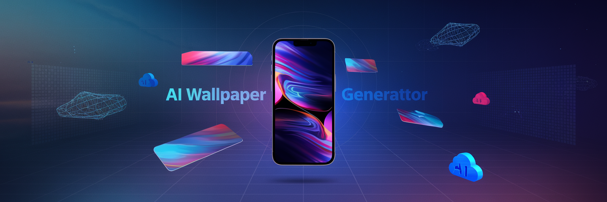
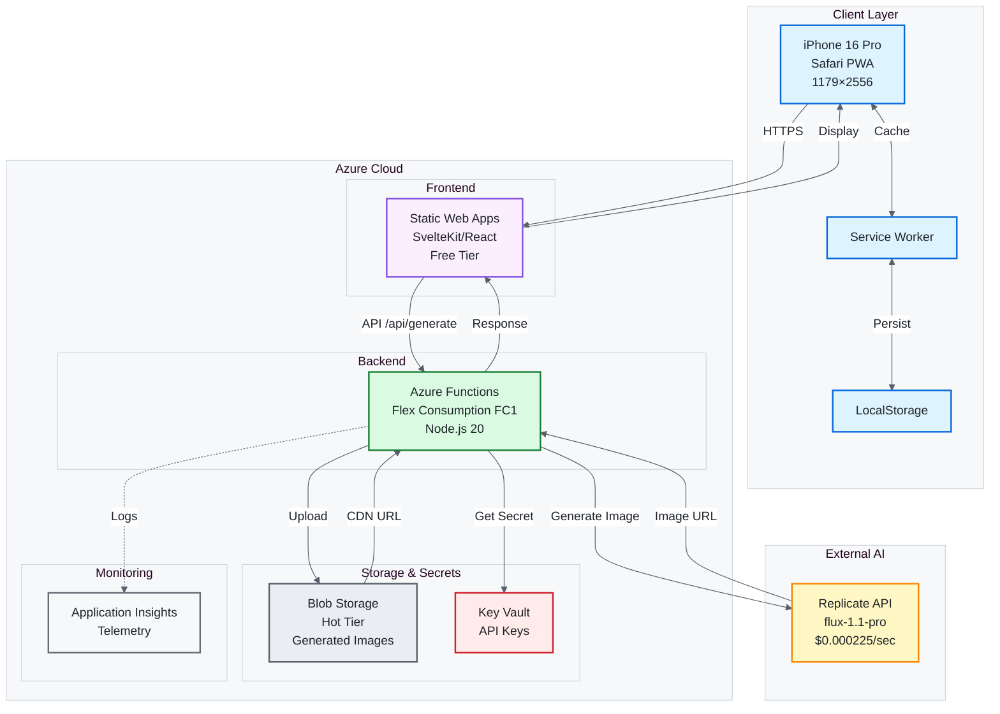
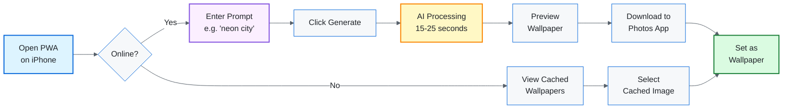
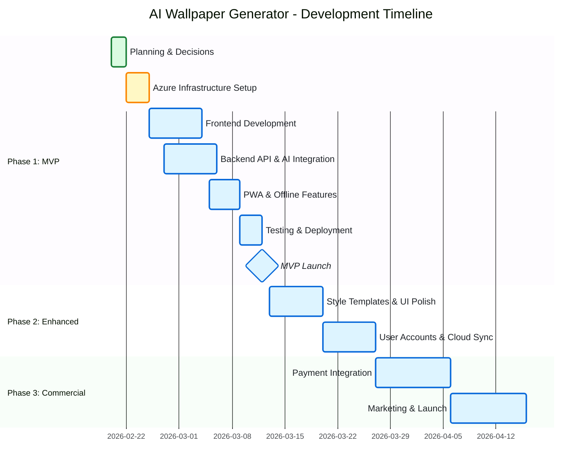

# AI Wallpaper Generator for iPhone

<p align="center">
  
</p>

<p align="center">
  <strong>Personal AI-powered wallpaper creation app optimized for iPhone 16 Pro</strong>
</p>

<p align="center">
  Generate stunning, unique wallpapers using state-of-the-art AI models.<br/>
  Built as a Progressive Web App (PWA) with Azure serverless architecture.
</p>

<p align="center">
  <a href="https://github.com/fabioc-aloha/ai-wallpaper-generator/stargazers"></a>
  <a href="https://github.com/fabioc-aloha/ai-wallpaper-generator/blob/main/LICENSE"></a>
  <a href="https://github.com/fabioc-aloha/ai-wallpaper-generator/issues"></a>
</p>

---

## 📱 Target Device

- **iPhone 16 Pro** (1179×2556 resolution)
- **iOS 26.4 beta** (enhanced PWA capabilities)
- Optimized for Dynamic Island and safe areas

---

## 🎯 Features

### MVP (Phase 1)
- ✨ AI wallpaper generation (Replicate flux-1.1-pro)
- 📱 Progressive Web App (installable)
- 🌐 Offline mode support
- 📱 Perfect fit for iPhone 16 Pro
- 💾 LocalStorage for history

### Future Enhancements (Phase 2-3)
- 🎨 Style presets and templates
- 👤 User accounts and cloud sync
- 🌓 Apple Watch complications
- 💳 Premium models and subscriptions

---

## 🎨 Model Comparison

**Banner Generation Tests** (February 21, 2026)

We tested multiple AI models with ultra-detailed prompts to compare quality:

| Model | Generation Time | Cost | Photorealism | Typography | Best Use Case |
|-------|----------------|------|--------------|------------|---------------|
| **Flux Pro** | 5-6s | $0.05 | ⭐⭐⭐⭐⭐ Excellent | ❌ Poor | Wallpapers (pure imagery) |
| **Flux 1.1 Pro** | 9-10s | $0.04 | ⭐⭐⭐⭐⭐ Excellent | ❌ Poor | Photorealistic scenes |
| **Ideogram v2** | 15-20s | $0.08 | ⭐⭐⭐⭐ Good | ✅ Excellent | Marketing banners with text |
| **Google Imagen 3** | ~15s | $0.025 | ⭐⭐⭐⭐ Good | 🟡 Moderate | Face consistency |

**Key Insight**: Even with 5,500-character hyper-detailed prompts specifying exact fonts, colors, and rendering requirements, **AI models struggle with readable typography**. For wallpaper generation, focus on pure visual content without text overlays.

**Production Choice**: Using **Flux Pro** for best photorealistic quality at reasonable cost.

---

## 💰 Cost Estimate

| Phase | Users | Wallpapers/Month | Monthly Cost |
|-------|-------|------------------|--------------|
| MVP | 1 | 200 | $10.12 |
| Enhanced | 1 | 500 | $25.10 |
| Commercial | 100 | 5,000 | $260.00 |

**Breakdown (MVP)** (using Flux Pro @ $0.05/wallpaper):
- Replicate API: $10.00 (200 wallpapers × $0.05)
- Azure Storage: $0.02
- Azure Functions: $0.08
- Key Vault: $0.02
- Static Web Apps: Free
- Application Insights: Free tier

**Note**: Cost is based on empirical testing with Flux Pro model. See [docs/AI-MODEL-GUIDE.md](docs/AI-MODEL-GUIDE.md) for detailed model comparison.

---

## 🚀 Quick Start

### 0. Local Development (Start Here!)
Run the app locally before deploying to Azure:

**5-Minute Setup**:
```powershell
# Install dependencies
cd api && npm install
cd ../frontend && npm install

# Configure Replicate API token in api/local.settings.json
# Start backend: cd api && npm start
# Start frontend: cd frontend && npm run dev
# Open: http://localhost:5173
```

Full guide: [docs/LOCAL-DEVELOPMENT.md](docs/LOCAL-DEVELOPMENT.md)

---

### 1. Make Decisions
Read [docs/DECISIONS.md](docs/DECISIONS.md) and fill out your choices:
- Framework (SvelteKit vs React) ✅ *Decision: SvelteKit*
- MVP scope (minimal vs enhanced) ✅ *Decision: Minimal MVP*
- Database (LocalStorage vs Table Storage) ✅ *Decision: LocalStorage only*
- AI Model (Flux Pro vs alternatives) ✅ *Decision: Flux Pro*

### 2. Set Up Azure Infrastructure
Follow [docs/AZURE-SETUP.md](docs/AZURE-SETUP.md) to deploy:
- Storage Account
- Key Vault (with Replicate API key)
- Application Insights
- Azure Functions (Flex Consumption)
- Static Web App
- Budget alerts

**Time**: ~2-3 hours
**Cost**: Free tier for MVP

### 3. Develop
Follow [docs/DEVELOPMENT-GUIDE.md](docs/DEVELOPMENT-GUIDE.md) week by week:
- **Week 1**: Azure setup + frontend scaffold
- **Week 2**: Backend API + Replicate integration
- **Week 3**: PWA features + offline mode
- **Week 4**: Testing + deployment

**Time**: 3-4 weeks (30 hrs/week)

### 4. Test
Complete [docs/TESTING-CHECKLIST.md](docs/TESTING-CHECKLIST.md):
- 40 comprehensive test cases
- iPhone 16 Pro-specific validation
- Performance benchmarks
- Cost tracking verification

**Time**: 4-6 hours

### 5. Deploy
Follow [docs/DEPLOYMENT-GUIDE.md](docs/DEPLOYMENT-GUIDE.md):
- Option 1: SWA CLI (manual)
- Option 2: GitHub Actions (automated CI/CD)
- Production monitoring setup
- Rollback procedures

**Time**: 1-2 hours (initial), 15 minutes (ongoing)

---

## 📚 Documentation Index

| Document | Purpose | When to Read |
|----------|---------|--------------|
| [ARCHITECTURE.md](ARCHITECTURE.md) | Technical specification and system design | Reference throughout development |
| [docs/DECISIONS.md](docs/DECISIONS.md) | Decision-making guide with trade-off analysis | **Start here** - before coding |
| [docs/ROADMAP.md](docs/ROADMAP.md) | Phased timeline with milestones and costs | Project planning |
| [docs/DEVELOPMENT-GUIDE.md](docs/DEVELOPMENT-GUIDE.md) | Week-by-week implementation with code examples | During development (Days 1-28) |
| [docs/AZURE-SETUP.md](docs/AZURE-SETUP.md) | Azure CLI commands and infrastructure deployment | Week 1, Days 2-3 |
| [docs/TESTING-CHECKLIST.md](docs/TESTING-CHECKLIST.md) | Comprehensive QA with 40 test cases | Week 3-4 + pre-launch |
| [docs/DEPLOYMENT-GUIDE.md](docs/DEPLOYMENT-GUIDE.md) | Production deployment and CI/CD setup | Week 4 + ongoing |

---

## 🛠️ Technology Stack

### Frontend
- **Framework**: SvelteKit (recommended) or React + Vite
- **PWA**: vite-plugin-pwa, Workbox
- **UI**: Tailwind CSS (optional)
- **State**: Svelte stores or React Context

### Backend
- **Runtime**: Node.js 20
- **Functions**: Azure Functions v4 (TypeScript)
- **AI**: Replicate API (flux-1.1-pro model)
- **Storage**: Azure Blob Storage (Hot tier)
- **Secrets**: Azure Key Vault

### Infrastructure
- **Hosting**: Azure Static Web Apps (Free tier)
- **Compute**: Azure Functions Flex Consumption (FC1)
- **Monitoring**: Application Insights
- **CI/CD**: GitHub Actions

---

## 📐 Architecture Highlights



### User Journey



---

## 🔐 Security

- **Secrets**: Stored in Azure Key Vault (never in code)
- **Authentication**: Managed Identity (no password storage)
- **API Keys**: Retrieved at runtime via Key Vault SDK
- **CORS**: Restricted to Static Web App origin
- **HTTPS**: Enforced via Azure (automatic SSL)

---

## 📊 Success Metrics

### Technical
- Page load: < 2 seconds
- Generation time: 15-25 seconds
- Error rate: < 1%
- PWA Lighthouse score: > 90

### Business
- Personal use: 200 wallpapers/month
- Cost: < $1.10/month
- User satisfaction: Self (initially)
- Future: 100 users @ $2.99/month → $242 revenue

---

## 🗓️ Timeline

| Phase | Duration | Deliverable | Cost/Month |
|-------|----------|-------------|------------|
| **Planning** | 1 week | Documentation complete ✅ | $0 |
| **MVP Development** | 3-4 weeks | Functional PWA | $1.02 |
| **Testing & Launch** | 1 week | Production deployment | $1.02 |
| **Enhanced Features** | 4 weeks | User accounts, styles | $2.61 |
| **Commercialization** | 8 weeks | Payment, scaling | $242.65 |

**Total to MVP**: ~4-5 weeks (110 hours)

### Development Phases



---

## 🎯 Next Steps

### Immediate (Today)
1. ✅ Review [docs/DECISIONS.md](docs/DECISIONS.md)
2. ✅ Fill out "My Decisions" section
3. ✅ Choose framework (SvelteKit recommended)
4. ✅ Decide MVP scope (minimal recommended)

### This Week
1. ⏳ Complete [docs/AZURE-SETUP.md](docs/AZURE-SETUP.md) (2-3 hours)
2. ⏳ Install Replicate API key in Key Vault
3. ⏳ Verify all resources deployed
4. ⏳ Begin Week 1 of [docs/DEVELOPMENT-GUIDE.md](docs/DEVELOPMENT-GUIDE.md)

### Weeks 2-4
1. ⏳ Follow day-by-day tasks in DEVELOPMENT-GUIDE.md
2. ⏳ Commit code daily to Git
3. ⏳ Test on iPhone 16 Pro frequently
4. ⏳ Monitor costs in Azure Portal

---

## 🐛 Troubleshooting

Common issues and solutions documented in:
- [DEVELOPMENT-GUIDE.md](docs/DEVELOPMENT-GUIDE.md#troubleshooting)
- [DEPLOYMENT-GUIDE.md](docs/DEPLOYMENT-GUIDE.md#troubleshooting)

For Azure-specific issues:
- Check Azure status: https://status.azure.com
- View Functions logs: Azure Portal → Function App → Log Stream
- Application Insights: Failures + Performance tabs

---

## 📞 Support

- **Documentation**: All guides in `docs/` folder
- **Azure Help**: Azure Portal → Support tickets
- **Replicate Help**: https://replicate.com/docs
- **GitHub Copilot**: Available 24/7 for debugging

---

## 📝 License

Personal use project. No license required (yet).

If commercializing, consider:
- MIT License (permissive)
- Proprietary (closed source)

---

## 🙏 Acknowledgments

- **Replicate**: flux-1.1-pro model by Black Forest Labs
- **Azure**: Serverless infrastructure
- **SvelteKit**: PWA framework (if chosen)
- **Alex (AI Architect)**: Planning and documentation 😊

---

**Project Version**: 0.1.0 (Planning Phase)
**Last Updated**: February 20, 2026
**Status**: 📋 Ready for development

---

## 📖 Quick Reference

```bash
# Development
npm run dev                  # Start local dev server
npm run build                # Build for production
npm run test                 # Run tests

# Azure
az group create              # Create resource group
swa start                    # Local SWA emulator
swa deploy                   # Deploy to Azure

# GitHub
git add . && git commit -m   # Commit changes
git push origin main         # Trigger CI/CD deployment

# Monitoring
az monitor metrics list      # View Azure metrics
open https://portal.azure.com  # Azure Portal dashboard
```

---

**Ready to start?** → Begin with [docs/DECISIONS.md](docs/DECISIONS.md) 🚀
