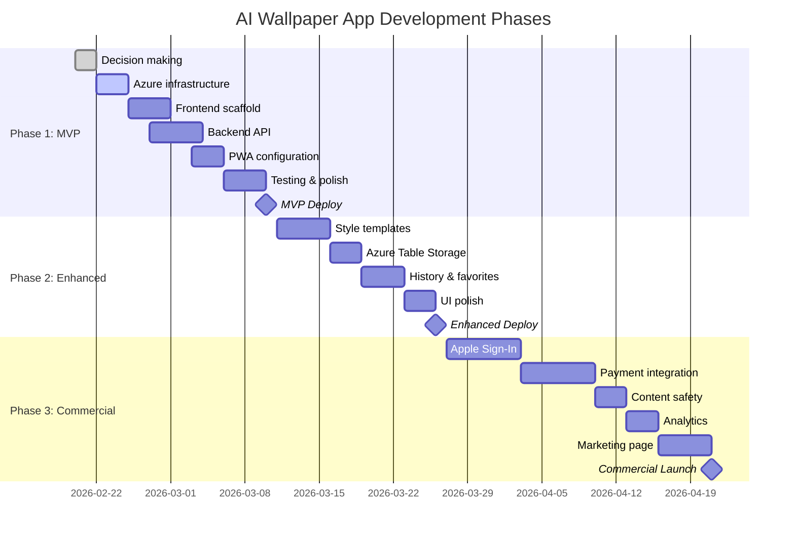

# Development Roadmap - AI Wallpaper App

**Project**: iPhone AI Wallpaper Generator
**Target Device**: iPhone 16 Pro (iOS 26.4 beta)
**Start Date**: February 20, 2026
**Estimated MVP Completion**: 3-4 weeks

---

## Roadmap Overview



---

## Phase 1: MVP (Weeks 1-4)

**Goal**: Generate AI wallpapers on your iPhone 16 Pro
**Success Criteria**: Create 10 wallpapers successfully
**Budget**: ~$1.12/month

### Week 1: Foundation (Days 1-7)

**Days 1-2: Decisions & Planning**
- ✅ Complete [DECISIONS.md](./DECISIONS.md) worksheet
- ✅ Choose framework (SvelteKit or React)
- ✅ Review architecture document
- ✅ Set up budget alerts in Azure

**Days 3-4: Azure Infrastructure**
- [ ] Create Azure subscription (if needed)
- [ ] Provision resource group
- [ ] Deploy Azure Static Web Apps
- [ ] Create Azure Functions app (Flex Consumption)
- [ ] Set up Azure Blob Storage
- [ ] Configure Azure Key Vault
- [ ] Store Replicate API key
- [ ] Enable Application Insights

**📝 Deliverable**: Azure resources provisioned, URLs generated

**Days 5-7: Frontend Scaffold**
- [ ] Initialize SvelteKit/React project
- [ ] Add PWA support (vite-plugin-pwa)
- [ ] Configure Web App Manifest
- [ ] Set up Service Worker
- [ ] Create basic UI layout
- [ ] Add iOS viewport meta tags
- [ ] Test "Add to Home Screen" on iPhone

**📝 Deliverable**: PWA installable on iPhone, shows basic UI

---

### Week 2: Core Functionality (Days 8-14)

**Days 8-10: Backend API**
- [ ] Initialize Azure Functions project (TypeScript)
- [ ] Set up host.json with v4 extensions
- [ ] Install dependencies (Replicate, Azure SDKs)
- [ ] Create `/api/generate` endpoint
- [ ] Implement Key Vault secret retrieval
- [ ] Add Replicate API client
- [ ] Test locally with `func start`

**Days 11-12: Integration**
- [ ] Connect frontend to backend API
- [ ] Add loading states (spinner during generation)
- [ ] Implement error handling
- [ ] Add retry logic for failed generations
- [ ] Upload generated images to Blob Storage
- [ ] Return CDN URLs to frontend

**Days 13-14: Core Features**
- [ ] Display generated wallpaper
- [ ] Add download button
- [ ] Implement LocalStorage for prompt history
- [ ] Show last 10 prompts in dropdown
- [ ] Add basic input validation
- [ ] Test end-to-end flow

**📝 Deliverable**: Generate wallpaper from prompt → download to Photos

---

### Week 3: PWA & Offline (Days 15-21)

**Days 15-17: PWA Features**
- [ ] Configure Service Worker caching strategy
- [ ] Cache last 5 generated wallpapers
- [ ] Add offline detection
- [ ] Show cached wallpapers when offline
- [ ] Implement app icon and splash screen
- [ ] Test installation on iPhone 16 Pro

**Days 18-19: UI Polish**
- [ ] Responsive design for iPhone 16 Pro viewport
- [ ] Safe area handling (Dynamic Island)
- [ ] Dark mode support
- [ ] Loading animations
- [ ] Error messages (user-friendly)
- [ ] Empty states

**Days 20-21: Testing**
- [ ] Test on actual iPhone 16 Pro
- [ ] Verify offline mode works
- [ ] Test Add to Home Screen flow
- [ ] Check all error scenarios
- [ ] Performance testing (page load, generation time)
- [ ] Fix critical bugs

**📝 Deliverable**: Fully functional PWA with offline support

---

### Week 4: Deploy & Iterate (Days 22-28)

**Days 22-23: Pre-Deployment**
- [ ] Environment variable configuration
- [ ] Production API keys in Key Vault
- [ ] Set up budget alerts
- [ ] Configure Application Insights
- [ ] Create deployment script
- [ ] Test in staging environment

**Days 24-25: Deployment**
- [ ] Deploy frontend to Static Web Apps
- [ ] Deploy backend to Azure Functions
- [ ] Verify CORS configuration
- [ ] Test production endpoints
- [ ] Monitor Application Insights
- [ ] Document deployment process

**Days 26-28: User Testing & Iteration**
- [ ] **USE THE APP**: Generate 20+ wallpapers
- [ ] Document issues and improvements
- [ ] Fix critical bugs
- [ ] Optimize prompts for better results
- [ ] Measure costs (actual vs estimated)
- [ ] Gather feedback (if sharing with friends)

**📝 Deliverable**: ✅ **MVP COMPLETE** - Production-ready PWA

---

## Milestone: MVP Completion Checklist

**Before marking MVP complete, verify**:

```
User Flow:
[ ] Open app from iPhone home screen icon
[ ] Enter prompt: "Serene ocean sunset, vibrant colors"
[ ] Click Generate (< 30 seconds)
[ ] Wallpaper displays correctly (1179x2556)
[ ] Download to Photos app
[ ] Set as Lock Screen wallpaper
[ ] Test offline: app loads, shows cached wallpapers
[ ] Close and reopen: prompt history persists

Technical:
[ ] Application Insights showing telemetry
[ ] Costs under $2/month for 200 wallpapers
[ ] No console errors
[ ] PWA manifest valid
[ ] Service Worker active
[ ] HTTPS working

Quality:
[ ] UI looks good on iPhone 16 Pro
[ ] No text cutoff by Dynamic Island
[ ] Loading states clear
[ ] Error handling works
[ ] Generated wallpapers are high quality
```

**MVP Success**: If all boxes checked ✅

---

## Phase 2: Enhanced (Weeks 5-8)

**Goal**: Improve UX and add creative features
**Budget**: ~$2.61/month

### Week 5: Style Templates (Days 29-35)

**Days 29-31: Template System**
- [ ] Create style preset configurations
- [ ] Design template selector UI
- [ ] Implement prompt augmentation
- [ ] Add template preview images
- [ ] Test each style (Nature, Abstract, Minimalist, Cyberpunk)

**Templates to Create**:
```typescript
const templates = {
  nature: {
    suffix: "landscape photography, vibrant colors, ultra detailed, 8K quality",
    examples: ["Mountain sunrise", "Ocean waves", "Forest path"]
  },
  abstract: {
    suffix: "abstract art, geometric patterns, bold colors, modern design",
    examples: ["Flowing shapes", "Color gradients", "Fractal patterns"]
  },
  minimalist: {
    suffix: "minimalist design, clean lines, simple, elegant, negative space",
    examples: ["Single color", "Geometric shapes", "Zen aesthetic"]
  },
  cyberpunk: {
    suffix: "cyberpunk aesthetic, neon lights, futuristic city, dark atmosphere",
    examples: ["Neon cityscape", "Tech patterns", "Digital rain"]
  }
};
```

**Days 32-35: UI Enhancement**
- [ ] Add template carousel
- [ ] Show example wallpapers per template
- [ ] Quick-select buttons
- [ ] Template + custom prompt combination
- [ ] Polish template selection UX

**📝 Deliverable**: 4 style templates working, better wallpaper quality

---

### Week 6: Data Persistence (Days 36-42)

**Days 36-38: Azure Table Storage**
- [ ] Create Table Storage account
- [ ] Design schema for wallpaper metadata
- [ ] Implement storage service layer
- [ ] Add CRUD operations
- [ ] Migrate LocalStorage data

**Days 39-42: History & Favorites**
- [ ] Build history screen (gallery view)
- [ ] Add favorite/unfavorite button
- [ ] Filter: All / Favorites
- [ ] Sort by: Recent / Oldest
- [ ] Delete unwanted wallpapers
- [ ] Pagination (if > 50 wallpapers)

**📝 Deliverable**: Full history and favorites system

---

### Week 7: Generation Features (Days 43-49)

**Days 43-45: Variations & Regenerate**
- [ ] "Regenerate" button (same prompt, new seed)
- [ ] "Similar style" (prompt variations)
- [ ] "Adjust" options (more/less vibrant, etc.)
- [ ] Save generation parameters for repro

**Days 46-49: Advanced Features**
- [ ] Generation queue (request 3, generate sequentially)
- [ ] Cost tracking per wallpaper
- [ ] Usage dashboard (total wallpapers, monthly cost)
- [ ] Export wallpaper metadata (JSON)

**📝 Deliverable**: Advanced generation features

---

### Week 8: Polish & Deploy (Days 50-56)

**Days 50-52: UI/UX Improvements**
- [ ] Animations (smooth transitions)
- [ ] Skeleton loaders
- [ ] Better empty states
- [ ] Onboarding tutorial (first-time users)
- [ ] Settings page

**Days 53-54: Performance**
- [ ] Image optimization (WebP format)
- [ ] Lazy loading
- [ ] Code splitting
- [ ] Bundle size optimization

**Days 55-56: Testing & Deployment**
- [ ] Full regression testing
- [ ] Deploy Phase 2
- [ ] Monitor costs and performance
- [ ] Update documentation

**📝 Deliverable**: ✅ **Phase 2 COMPLETE**

---

## Milestone: Phase 2 Completion Checklist

```
Features:
[ ] 4 style templates working perfectly
[ ] Full history (100+ wallpapers) with favorites
[ ] Regenerate and variations working
[ ] Usage dashboard showing costs
[ ] Offline mode with 20+ cached wallpapers

Performance:
[ ] Page load < 2 seconds
[ ] Generation time < 25 seconds
[ ] Costs under $3/month for 500 wallpapers
[ ] No performance degradation with large history

Quality:
[ ] Polished UI with animations
[ ] Onboarding for first-time users
[ ] Settings page functional
[ ] All edge cases handled
```

---

## Phase 3: Commercial (Weeks 9-16)

**Goal**: Prepare for public launch and monetization
**Budget**: ~$50-100/month (testing phase)

### Weeks 9-10: Authentication (Days 57-70)

**Apple Sign-In Integration**
- [ ] Apple Developer account setup
- [ ] Configure Sign in with Apple
- [ ] Implement OAuth 2.0 flow
- [ ] User profile storage
- [ ] Token management
- [ ] Session handling

**Account Features**
- [ ] User profile page
- [ ] Account settings
- [ ] Data export (GDPR)
- [ ] Delete account
- [ ] Privacy policy display

**📝 Deliverable**: Secure authentication system

---

### Weeks 11-12: Payments (Days 71-84)

**Stripe Integration**
- [ ] Stripe account setup
- [ ] Apple Pay configuration
- [ ] Credit purchase flow
- [ ] Pricing tiers (e.g., 50 wallpapers for $2.99)
- [ ] Receipt generation
- [ ] Refund handling

**Credit System**
- [ ] Credit balance tracking
- [ ] Deduct credits on generation
- [ ] Low balance warnings
- [ ] Purchase history

**📝 Deliverable**: Working payment system

---

### Weeks 13-14: Safety & Analytics (Days 85-98)

**Content Safety**
- [ ] Azure Content Safety integration
- [ ] NSFW filter
- [ ] Inappropriate prompt detection
- [ ] Moderation queue (if needed)

**Analytics & Monitoring**
- [ ] User analytics dashboard (admin)
- [ ] Popular prompts tracking
- [ ] Conversion metrics
- [ ] Error tracking
- [ ] Cost per user analytics

**📝 Deliverable**: Safe, monitored platform

---

### Weeks 15-16: Launch Prep (Days 99-112)

**Legal & Compliance**
- [ ] Terms of Service
- [ ] Privacy Policy
- [ ] GDPR compliance review
- [ ] Content policy

**Marketing**
- [ ] Landing page
- [ ] Demo video
- [ ] Screenshots for marketing
- [ ] Social media presence
- [ ] Beta tester program

**Final Testing**
- [ ] Load testing (simulate 100 users)
- [ ] Security audit
- [ ] Performance optimization
- [ ] Bug fixes

**📝 Deliverable**: ✅ **COMMERCIAL LAUNCH READY**

---

## Phase 4: Native App (Optional, Weeks 17-28)

**Decision Point**: After Phase 3, evaluate if native app needed

**Triggers to Build Native**:
- [ ] 1000+ active users
- [ ] User requests for native features
- [ ] Want App Store presence
- [ ] Need Live Wallpapers
- [ ] Direct wallpaper setting (without manual download)

**Timeline**: 10-16 weeks for SwiftUI native app

---

## Resource Allocation

### Time Budget (Phase 1 MVP)

| Week | Frontend | Backend | Infrastructure | Testing | Total |
|------|----------|---------|----------------|---------|-------|
| 1 | 12 hrs | 4 hrs | 8 hrs | 4 hrs | **28 hrs** |
| 2 | 8 hrs | 12 hrs | 2 hrs | 6 hrs | **28 hrs** |
| 3 | 16 hrs | 4 hrs | 2 hrs | 8 hrs | **30 hrs** |
| 4 | 6 hrs | 2 hrs | 4 hrs | 12 hrs | **24 hrs** |
| **Total** | **42 hrs** | **22 hrs** | **16 hrs** | **30 hrs** | **110 hrs** |

**At 10 hrs/week**: 11 weeks
**At 20 hrs/week**: 5-6 weeks
**At 30 hrs/week**: 3-4 weeks ✅

---

## Cost Projections

| Phase | Duration | Monthly Cost | One-Time Costs | Notes |
|-------|----------|--------------|----------------|-------|
| **Phase 1** | 3-4 weeks | $1.12 | $0 | Personal use only |
| **Phase 2** | 4 weeks | $2.61 | $0 | More features, more usage |
| **Phase 3 (Testing)** | 8 weeks | $50-100 | $99 (Apple Developer) | Beta testing with real users |
| **Phase 3 (Launch)** | Ongoing | $200-300 | Stripe fees (2.9% + $0.30) | Need 82 paying users to break even |

**Break-Even Calculation** (Phase 3):
```
Monthly costs: $250
Revenue per user: $2.99/month
Break-even users: 250 / 2.99 = 84 users

Margin after 100 users:
Revenue: 100 × $2.99 = $299
Costs: $250
Profit: $49/month
```

---

## Risk Management Timeline

### Checkpoints

**Week 2 Checkpoint**:
- ✅ First wallpaper generated successfully?
- ⚠️ If no: Debug Replicate API integration, check Azure Function logs

**Week 4 Checkpoint**:
- ✅ MVP working end-to-end?
- ⚠️ If no: Cut scope, deploy partial features

**Week 8 Checkpoint**:
- ✅ Costs under $3/month?
- ⚠️ If no: Optimize Replicate usage, review blob storage costs

**Week 16 Checkpoint**:
- ✅ 10+ paying users?
- ⚠️ If no: Re-evaluate commercialization, consider pivot

---

## Decision Points

**After MVP (Week 4)**:
- 🤔 Continue to Phase 2? Or iterate on MVP?
- 🤔 Share with friends for feedback?
- 🤔 Is the quality good enough?

**After Phase 2 (Week 8)**:
- 🤔 Commercialize (Phase 3) or keep personal?
- 🤔 Happy with costs and complexity?
- 🤔 Build native app?

**After Phase 3 (Week 16)**:
- 🤔 Scale up or maintain current size?
- 🤔 Add more AI models?
- 🤔 Expand to Android?

---

## Success Metrics

### Phase 1 (MVP)
- ✅ Generate 10+ wallpapers successfully
- ✅ PWA installs and works offline
- ✅ Costs under $2/month
- ✅ No critical bugs

### Phase 2 (Enhanced)
- ✅ 100+ wallpapers in history
- ✅ All 4 style templates working well
- ✅ Friends using it (if shared)
- ✅ Costs under $5/month

### Phase 3 (Commercial)
- ✅ 10 paying beta users
- ✅ Zero NSFW content issues
- ✅ 50+ paying users within 2 months
- ✅ Break even (84+ users) within 3 months

---

## Roadmap Adjustments

**This roadmap is a guide, not a contract**. Adjust based on:

1. **Your available time**: Running behind? Cut scope.
2. **Technical challenges**: Azure issues? Add buffer days.
3. **Budget constraints**: Costs too high? Optimize before proceeding.
4. **User feedback**: Great responses? Accelerate to Phase 3.
5. **iOS beta changes**: Beta features break? Add workaround time.

**Update this document** as you progress with actual dates and learnings.

---

**Document Version**: 1.0
**Last Updated**: February 20, 2026
**Current Phase**: Pre-Development (Decision making)
